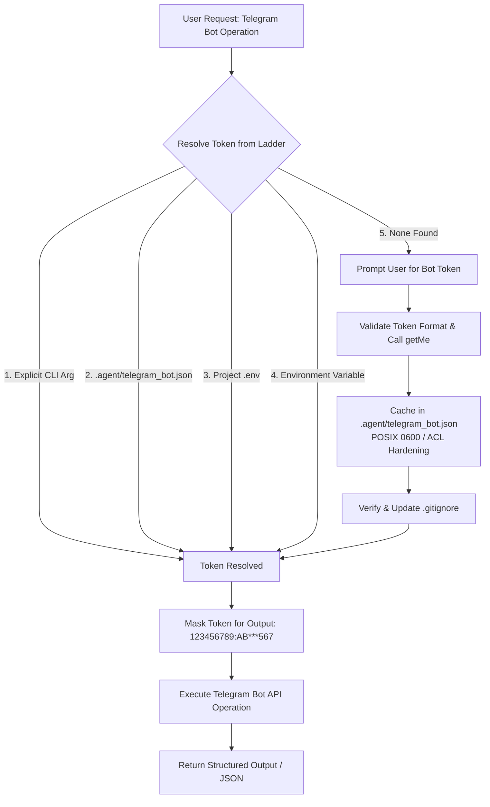

# Telegram Bot Manager Skill

A cross-platform, enterprise-grade skill for managing Telegram bots, securely caching API tokens on a per-project basis, dispatching notifications and media, administering chats, configuring webhooks, and scaffolding production bot applications.

---

## 🧭 Workflow & Token Resolution Architecture

Whenever Telegram bot operations are requested, follow this automated workflow:



---

## 🔐 Zero-Leak Credential Resolution Ladder

Tokens are resolved in the following strict priority order:

1. **Explicit Argument**: `--token <BOT_TOKEN>`
2. **Project Cache**: `<project_root>/.agent/telegram_bot.json`
3. **Project `.env`**: `TELEGRAM_BOT_TOKEN=<TOKEN>`
4. **Process Environment**: `os.environ["TELEGRAM_BOT_TOKEN"]`
5. **Global User Cache**: `~/.gemini/config/telegram_bot.json`

### 🛡️ Safety & Per-Project Caching Directives
- **Automatic `.gitignore` Protection**: Caching a token automatically ensures that `.agent/` or `.agent/telegram_bot.json` is appended to the project's `.gitignore` if Git is initialized.
- **Strict File Permissions**:
  - **POSIX (Linux/macOS)**: Directory permissions `0700` (`rwx------`), file permissions `0600` (`rw-------`).
  - **Windows**: File created within the local user context with restricted write access.
- **Strict Output Masking**: Raw tokens are never logged or echoed in conversation transcripts. The secret suffix is always masked (e.g. `123456789:AB***xyz`).

---

## ⚡ CLI Quick Reference

The skill provides a pure Python CLI (`scripts/telegram_cli.py`) with zero third-party dependencies, running out-of-the-box on Windows, Linux, and macOS.

Convenient wrapper scripts are also provided:
- Windows: `.\scripts\run.ps1 <subcommand>`
- Linux / macOS: `./scripts/run.sh <subcommand>`

### 1. Token & Cache Management (`auth`)
```bash
# Set and verify token for current project (validates via getMe)
python scripts/telegram_cli.py auth set --token "123456789:ABCdefGHIjklMNOpqrsTUVwxyz1234567"

# Set token for a named profile without live network verification
python scripts/telegram_cli.py auth set --token "<TOKEN>" --profile alerts --no-verify

# Check current project token status & live bot connectivity
python scripts/telegram_cli.py auth status

# Return status in JSON format (ideal for subagents)
python scripts/telegram_cli.py auth status --json

# Remove cached token from current project
python scripts/telegram_cli.py auth remove
```

### 2. Bot Profile & Identity (`bot`)
```bash
# Test authentication and inspect bot profile
python scripts/telegram_cli.py bot get-me

# Get or update bot display name
python scripts/telegram_cli.py bot name
python scripts/telegram_cli.py bot name --set "Project Alert Bot"

# Set bot description (shown before starting chat)
python scripts/telegram_cli.py bot description --set "Antigravity Automated Telegram Bot"

# Set bot commands menu
python scripts/telegram_cli.py bot commands --set '[{"command":"start","description":"Initialize bot"},{"command":"status","description":"System health"}]'
```

### 3. Messaging & Media (`send`)
```bash
# Send formatted HTML message
python scripts/telegram_cli.py send message \
  --chat-id "-1001234567890" \
  --text "🚀 <b>Deploy Notification</b>: Release v1.2.0 deployed successfully."

# Send silent message to specific topic thread in supergroup
python scripts/telegram_cli.py send message \
  --chat-id "-1001234567890" \
  --thread-id 42 \
  --text "Build artifact ready" \
  --silent

# Send local image or file attachment (automatic multipart upload)
python scripts/telegram_cli.py send photo --chat-id "-1001234567890" --photo "./assets/chart.png" --caption "Daily Performance"
python scripts/telegram_cli.py send document --chat-id "-1001234567890" --document "./dist/report.pdf" --caption "Audit Report"

# Send status typing indicator
python scripts/telegram_cli.py send action --chat-id "123456789" --action typing
```

### 4. Webhooks & Polling (`webhook`, `updates`)
```bash
# Check current webhook status
python scripts/telegram_cli.py webhook info

# Set webhook with secret token verification
python scripts/telegram_cli.py webhook set \
  --url "https://api.yourdomain.com/telegram/webhook" \
  --secret-token "a_secure_random_token_123" \
  --drop-pending

# Delete webhook to switch back to long polling
python scripts/telegram_cli.py webhook delete --drop-pending

# Poll recent updates for testing/debugging
python scripts/telegram_cli.py updates get --limit 5
```

### 5. Chat Administration (`chat`)
```bash
# Inspect chat metadata and permissions
python scripts/telegram_cli.py chat info --chat-id "-1001234567890"

# List administrators in a chat
python scripts/telegram_cli.py chat admins --chat-id "-1001234567890"

# Pin important announcement message
python scripts/telegram_cli.py chat pin --chat-id "-1001234567890" --message-id 345
```

### 6. Project Code Scaffolding (`scaffold`)
Generate complete, runnable starter bots pre-wired to load the cached project token:
```bash
# Generate lightweight native Python bot
python scripts/telegram_cli.py scaffold --framework python-native

# Generate modern async Aiogram 3.x bot
python scripts/telegram_cli.py scaffold --framework aiogram

# Generate python-telegram-bot (PTB) application
python scripts/telegram_cli.py scaffold --framework python-telegram-bot

# Generate production FastAPI webhook receiver
python scripts/telegram_cli.py scaffold --framework fastapi-webhook

# Generate TypeScript / Node.js grammY bot
python scripts/telegram_cli.py scaffold --framework grammy-node
```

---

## 💻 Programmatic Token Consumption in Project Code

When creating application code within a project that uses this skill, use this standard snippet to load the cached token:

### Python
```python
import json
import os
from pathlib import Path

def get_project_bot_token(profile: str = "default") -> str:
    # 1. Environment variable override
    env_token = os.environ.get("TELEGRAM_BOT_TOKEN")
    if env_token:
        return env_token.strip()

    # 2. Local project cache
    cache_path = Path(__file__).resolve().parent / ".agent" / "telegram_bot.json"
    if cache_path.exists():
        try:
            data = json.loads(cache_path.read_text(encoding="utf-8"))
            token = data.get("profiles", {}).get(profile, {}).get("token")
            if token:
                return token.strip()
        except Exception:
            pass

    raise RuntimeError("Telegram bot token not found. Run 'python scripts/telegram_cli.py auth set --token <TOKEN>'")
```

---

## 📚 Detailed Reference Documentation

- [API Reference](file:///d:/Projects/Personal/agent-telegram/references/api-reference.md): Telegram Bot API method and parameter specs.
- [Security & Caching](file:///d:/Projects/Personal/agent-telegram/references/security-and-caching.md): Permission models, cache schemas, and Zero-Leak policies.
- [Framework Guides](file:///d:/Projects/Personal/agent-telegram/references/framework-guides.md): Detailed recipes for Aiogram, PTB, grammY, and FastAPI.
- [Alert Dispatcher Example](file:///d:/Projects/Personal/agent-telegram/examples/alert_dispatcher.py): Operations alert script.
- [Echo Polling Bot](file:///d:/Projects/Personal/agent-telegram/examples/polling_echo_bot.py): Standalone zero-dependency polling bot.
- [FastAPI Webhook Server](file:///d:/Projects/Personal/agent-telegram/examples/webhook_server_fastapi.py): Production webhook service.
