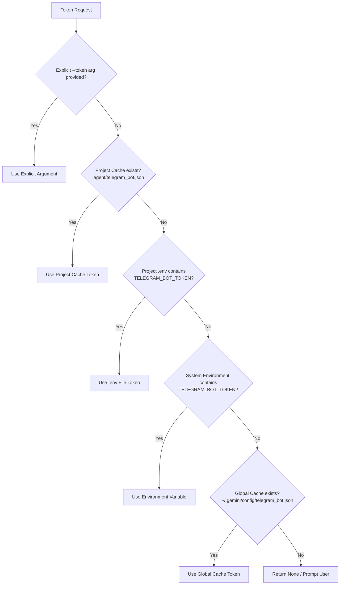

# Security & Safe Per-Project Token Caching

The `telegram-bot-manager` skill implements enterprise-grade credential security and strict adherence to **Priority 7: Zero-Leak Secret Security**.

---

## 🔐 1. Credential Resolution Ladder

When any Telegram command or script executes, the bot token is resolved dynamically using this descending priority ladder:



---

## 🛡️ 2. Safe Per-Project Caching Architecture

When caching a token using `auth set`:
1. **Isolated Storage**: Tokens are saved within the project's root in `.agent/telegram_bot.json`.
2. **Permission Hardening**:
   - **POSIX (Linux / macOS)**: The `.agent/` directory is created with `0700` (`rwx------`) permissions, and `telegram_bot.json` is created with `0600` (`rw-------`), ensuring only the current user can access the file.
   - **Windows**: The file is created within the local user context and secured against unauthorized modifications.
3. **Automated `.gitignore` Protection**:
   - Every time `auth set` runs, the CLI checks if `<project_root>/.gitignore` exists.
   - If present, it checks for `.agent/` or `.agent/telegram_bot.json`. If missing, it automatically appends the entry.
   - If `.gitignore` does not exist and the project is a Git repository, it creates one with `.agent/`, `.env`, and credential patterns.
4. **Token Masking**:
   - Tokens follow the structure `<bot_id>:<secret>` (e.g. `123456789:ABCdefGHIjklMNOpqrsTUVwxyz1234567`).
   - All logging, status commands, and error reports automatically mask the secret: `123456789:AB***567`.
   - Raw tokens are never logged or exposed in conversation transcripts.

---

## 🗂️ 3. Cache File Schema

The cache file `.agent/telegram_bot.json` stores bot metadata alongside the token:

```json
{
  "version": "1.0",
  "profiles": {
    "default": {
      "token": "123456789:ABCdefGHIjklMNOpqrsTUVwxyz1234567",
      "bot_id": 123456789,
      "is_bot": true,
      "first_name": "Antigravity Assistant",
      "username": "antigravity_assistant_bot",
      "can_join_groups": true,
      "can_read_all_group_messages": false,
      "supports_inline_queries": false,
      "updated_at": "2026-09-28T20:00:00Z"
    },
    "alerts": {
      "token": "987654321:ZYXwvutsRQPonmlKJIhgfEDCba7654321",
      "bot_id": 987654321,
      "username": "deployment_alerts_bot",
      "first_name": "Deploy Alerts",
      "updated_at": "2026-09-28T20:05:00Z"
    }
  }
}
```

---

## 👥 4. Multi-Profile Management

Projects that manage multiple bots (e.g. a public bot and a private monitoring alert bot) can use named profiles:

```bash
# Set alert bot profile
python scripts/telegram_cli.py auth set --token "<ALERT_BOT_TOKEN>" --profile alerts

# Check status of alert bot
python scripts/telegram_cli.py auth status --profile alerts

# Send message using specific profile
python scripts/telegram_cli.py send message --profile alerts --chat-id "-100..." --text "Deploy succeeded"
```

---

## 🔒 5. Zero-Leak Checklist for Agents

When interacting with Telegram bots in any workspace:
- [x] Never print raw bot tokens to terminal stdout or user-facing chat.
- [x] Always verify that `.agent/` is in `.gitignore` before committing.
- [x] Run `python scripts/telegram_cli.py auth status` to check existing project credentials before prompting the user for a token.
- [x] If no token is cached, prompt the user using standard confidential input without committing the token to code files.
